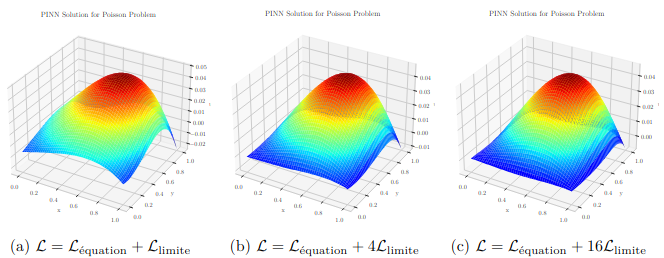

# Hybrid AI Poisson Solver



This project demonstrates hybrid methods for solving the two-dimensional Poisson equation on a unit square:

- **Physics-Informed Neural Networks (PINNs)**
- **Supervised Learning** using finite-difference solutions as training data
- **Finite Difference** method as a reference solution

The goal is to compare accuracy, runtime, and flexibility for each approach.

## Features

- Implementation of PINN and supervised neural network models in PyTorch
- Finite difference solver for generating ground-truth data
- Automated training and evaluation pipelines (`main.py`)
- Visualization of solutions, residuals, and error metrics
- LaTeX report generation with compiled figures (`/rapport`)
- Configurable hyperparameters in `config.py`

## Requirements

- Python 3.8 or higher
- PyTorch
- NumPy
- Matplotlib
- scikit-learn

Install dependencies:

```bash
pip install torch numpy matplotlib scikit-learn
```

## Project Structure

```txt
├── config.py           # Global parameters and device settings
├── data_utils.py       # Grid generation and train/test split helpers
├── fd_solver.py        # Finite-difference Poisson solver
├── models.py           # PINN and supervised network definitions
├── train.py            # Training loops for PINN and supervised models
├── visualization.py    # Plotting utilities for solutions and errors
├── main.py             # High-level script to run experiments and generate reports
├── border_coef_experiment.py  # Script to study PINN boundary-loss coefficient effects
├── TP_Hybrid_AI.ipynb  # Interactive notebook (demo)
├── TP_Hybrid_AI_Modular.ipynb # Modular notebook version
└── rapport/            # LaTeX report, figures, and output PDF
```

## Usage

1. Adjust hyperparameters in `config.py` if needed.
2. Run the main experiment script:

   ```bash
   python main.py
   ```

   This will:
   - Train PINN and supervised models
   - Solve Poisson with finite differences
   - Generate all figures in `rapport/figures/`

3. To explore boundary-loss coefficient experiments:

   ```bash
   python border_coef_experiment.py
   ```

4. View the compiled report:

   ```bash
   cd rapport
   pdflatex rapport.tex
   evince rapport.pdf
   ```

## Jupyter Notebooks

- **TP_Hybrid_AI.ipynb**: Step-by-step demonstration of data preparation, model training, and evaluation.
- **TP_Hybrid_AI_Modular.ipynb**: Modular version with reusable functions and blocks.

Open them with:

```bash
jupyter notebook TP_Hybrid_AI.ipynb
```

## Results & Reports

- The final report is located at `rapport/rapport.pdf`.
- Raw metrics and figure paths are saved in `rapport/records.json`.

## License

MIT License. Feel free to use and modify this code for research and educational purposes.
